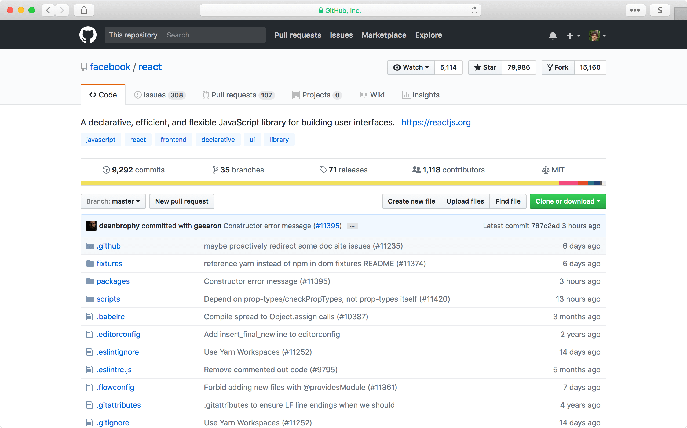
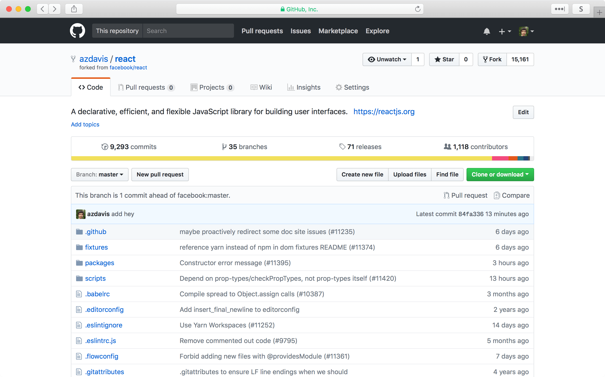
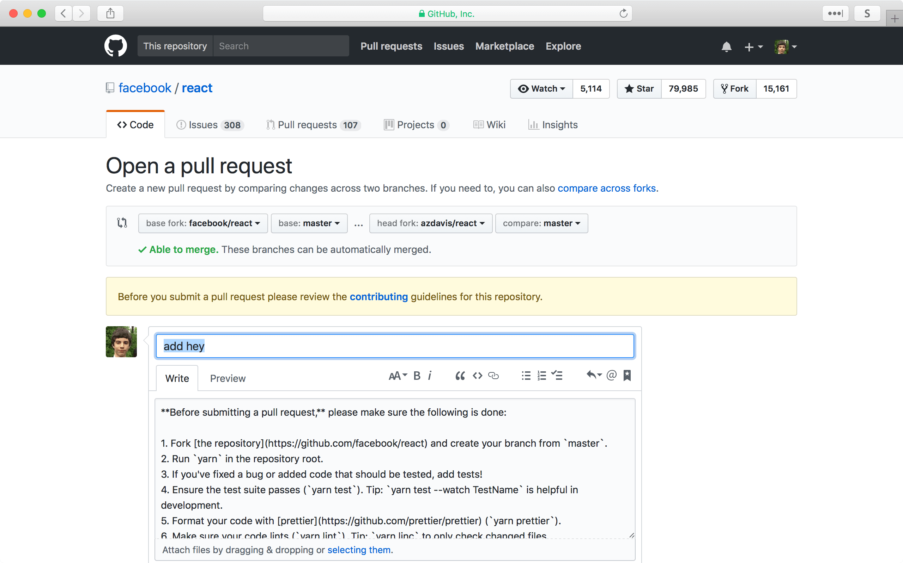

# git 02

	$ git gud
	git: 'gud' is not a git command. See 'git --help'.

	The most similar command is
		gui

15-131

## Agenda

- Merge conflicts
- Remote repositories
- GitHub: Fork & pull request

## A shorthand

Suppose we have a repo. Let's make a new branch and switch to it. We'd usually
do that with

	$ git branch test
	$ git checkout test
	Switched to branch 'test'

We can do that in one with

	$ git checkout -b test
	Switched to a new branch 'test'

## Merge conflicts

On our new branch, let's modify some files.

	$ echo hey >> a.txt
	$ echo hey >> b.txt
	$ git add .
	$ git commit -m 'modify a and b'
	[test 40b34cd] modify a and b
	 2 files changed, 2 insertions(+)

## Merge conflicts

Back on `master`:

	$ git checkout master
	Switched to branch 'master'
	$ echo hello >> b.txt
	$ echo hello >> c.txt
	$ git add .
	$ git commit -m 'modify b and c'
	[master 2b0ae7d] modify b and c
	 2 files changed, 2 insertions(+)

## Merge conflicts

Now, let's suppose we want to merge `test` into `master`.

Here's a problem, though. We modified `b.txt` in both `test` and `master`. Not
only that, but we modified the same _line_ of `b.txt`. Because of this, git
isn't going to be able to figure out which "version" of `b.txt` is the "right"
one.

	$ git merge test
	Auto-merging b.txt
	CONFLICT (content): Merge conflict in b.txt
	Automatic merge failed; fix conflicts and then commit the result.

## Merge conflicts

A good strategy: look at the status.

	$ git status
	On branch master
	You have unmerged paths.
	  (fix conflicts and run "git commit")
	  (use "git merge --abort" to abort the merge)

	Changes to be committed:

		modified:   a.txt

	Unmerged paths:
	  (use "git add <file>..." to mark resolution)

		both modified:   b.txt

We see that `a.txt`, which we modified on the `test` branch, doesn't have merge
conflicts. But `b.txt` does.

## Merge conflicts

What does `b.txt` look like right now?

	$ cat b.txt
	<<<<<<< HEAD
	hello
	=======
	hey
	>>>>>>> test

We see that git is showing us the way this line of `b.txt` looked both in
`HEAD` (i.e. `master`, the currently checked-out commit), and in `test` (i.e.,
the branch we're trying to merge).

## Merge conflicts

Let's resolve the merge conflict ourselves.

	$ vim b.txt
	...
	$ cat b.txt
	hello. hey. hi. what's up.

And then, tell git the conflict is resolved by adding `b.txt` to the index.

	$ git add b.txt
	$ git commit
	[master 78aa74d] Merge branch 'test'

## Remote repositories

Let's suppose we want to contribute to a project a lot of other people are
working on. Many projects, both open-source and private, host their git
repositories on a server.

A popular server to host open-source projects on is called GitHub. It's free to
make an account and use, if all of your projects are open-source. Other similar
services are GitLab and Bitbucket.

You'll need to have a GitHub account to complete the lab that's being released
today.

## Remote repositories

In order for us to work on a project, we first have to have the project on our
computer. So, given the URL where the project is accessible on the remote
server, we clone the repository.

	$ git clone <url>
	$ git status
	On branch master
	Your branch is up to date with 'origin/master'.

	nothing to commit, working tree clean

We can think of `origin` as representing the remote repository. `origin/master`
is the `master` branch on the remote repository.

## Remote repositories

Now, we can make some local commits. Let's make them on our local `master`
branch (the usual default branch.)

After we make commits locally, we can make our local commits available for
everyone else to see. We can say

	$ git push origin master

to mean, "Make it so that the `master` branch on the `origin` repository is
up-to-date with the `master` branch on my local repository."

## Remote repositories

Let's suppose we've been told there's important new commits available that
another developer made, and pushed to `origin`. We want to get those commits.

We can say

	$ git pull origin master

to mean, "Make it so that the `master` branch of my local repository is
up-to-date with the `master` branch of the `origin` repository." Basically, the
complement of `git pull`.

You've been doing this every week to get the new labs.

## Fork & pull request

It might not always be as easy as just clone, push, and pull.

	$ git clone https://github.com/facebook/react.git
	$ echo 'hey' >> README.md
	$ git add README.md
	$ git commit -m 'add hey'
	[master d95840b] add hey
	 1 file changed, 1 insertion(+)
	$ git push origin master
	remote: Permission to facebook/react.git denied to azdavis.
	fatal: unable to access 'https://github.com/facebook/react.git/':
	  The requested URL returned error: 403

This makes sense: although anyone can see the source code, it shouldn't be that
anyone can change it for everyone else.

## Fork & pull request

We need a way to make a request to the managers of this project. The request is
basically, "Hey, I've made some changes to the project, could you please pull
the changes I made into the official repo?"

In the GitHub parlance, this is called a pull request.

## Fork & pull request

What we first have to do is fork the official repo. What this does is make a
remote copy of the official repo that we can then push to.

This is different from just cloning the repo. Cloning gives us a local
repository that we can commit to. Forking gives us a remote repository that we
can push to.

## Fork & pull request

After we fork, we add our fork as a remote, and push our local commits, so that
other people can see them.

	$ git remote add azdavis https://github.com/azdavis/react.git
	$ git fetch azdavis
	$ git push azdavis master

## Fork & pull request

Now we start a pull request.

